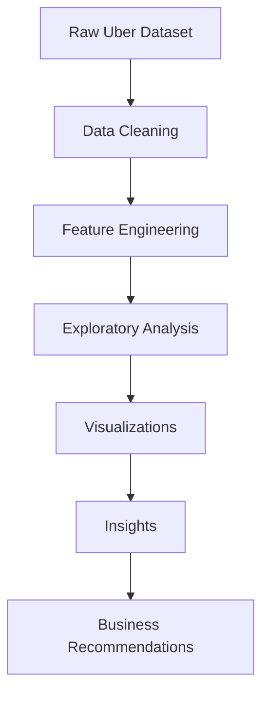

<div align="center">

# 🚖 Uber Data Analysis Using Python 🚖

### 📊 Exploratory Data Analysis • Data Visualization • Business Intelligence


<br>


<br>


<br>


</div>

---

# 🌟 Project Overview

🚖 **Uber Data Analysis using Python** is a complete Exploratory Data Analysis (EDA) project focused on uncovering hidden insights from Uber trip records.

Using powerful Python libraries such as **Pandas**, **NumPy**, **Matplotlib**, **Seaborn**, and **Plotly**, this project explores:

- ⏰ Peak Booking Hours
- 📅 Weekly & Monthly Ride Trends
- 📍 Popular Pickup Locations
- 🚖 Uber Base Performance
- 📈 Demand Patterns
- 🌍 Geographic Ride Distribution
- 💡 Business Recommendations

---

# ✨ Key Features

<table>
<tr>
<td>

### ⏰ Time Analysis

- Hourly Ride Distribution
- Peak Demand Detection
- Rush Hour Identification
- Day vs Night Analysis

</td>

<td>

### 📅 Trend Analysis

- Monthly Trends
- Weekly Patterns
- Seasonal Variations
- Ride Frequency Analysis

</td>
</tr>

<tr>
<td>

### 📍 Location Intelligence

- Popular Pickup Points
- Demand Hotspots
- Geographic Distribution
- Density Analysis

</td>

<td>

### 📊 Business Insights

- Fleet Optimization
- Driver Allocation
- Demand Forecasting Indicators
- Operational Recommendations

</td>
</tr>
</table>

---

# 🛠️ Tech Stack

| Tool | Purpose |
|--------|--------|
| 🐍 Python | Programming |
| 🐼 Pandas | Data Manipulation |
| 🔢 NumPy | Numerical Computing |
| 📊 Matplotlib | Data Visualization |
| 🎨 Seaborn | Statistical Visualization |
| 🌐 Plotly | Interactive Charts |
| 📓 Jupyter Notebook | Development Environment |

---

# 📂 Dataset Information

The dataset contains Uber trip records including:

```text
Date/Time
Latitude
Longitude
Base
Month
Day
Hour
Weekday
Pickup Location
Trip Count
```

### Dataset Features

✔ Time-series data

✔ Location information

✔ Operational base information

✔ Trip frequency records

✔ Transportation demand patterns

---

# ⚙️ Installation

## Clone Repository

```bash
git clone https://github.com/YOUR_USERNAME/Uber-Data-Analysis.git
```

```bash
cd Uber-Data-Analysis
```

## Install Requirements

```bash
pip install pandas numpy matplotlib seaborn plotly jupyter
```

## Launch Notebook

```bash
jupyter notebook
```

---

# 🔄 Project Workflow



---

# 🧹 Data Cleaning

### Missing Values

```python
df.isnull().sum()
df.dropna(inplace=True)
```

### Remove Duplicates

```python
df.drop_duplicates(inplace=True)
```

### Convert Datetime

```python
df["Date/Time"] = pd.to_datetime(df["Date/Time"])
```

### Basic Inspection

```python
df.info()
df.describe()
```

---

# ⚡ Feature Engineering

Extracted Features:

```python
df["Hour"]
df["Day"]
df["Month"]
df["Weekday"]
df["Weekday_Name"]
```

Example:

```python
df["Hour"] = df["Date/Time"].dt.hour
df["Month"] = df["Date/Time"].dt.month
df["Day"] = df["Date/Time"].dt.day
df["Weekday"] = df["Date/Time"].dt.day_name()
```

---

# 🐼 Pandas Operations Used

```python
groupby()
pivot_table()
agg()
merge()
apply()
value_counts()
sort_values()
query()
```

Examples:

```python
df.groupby("Hour").size()
```

```python
df.groupby("Weekday").size()
```

```python
df.groupby("Month").size()
```

---

# 🎨 Visualization Techniques

### Matplotlib

```python
plt.style.use("dark_background")
```

```python
plt.figure(figsize=(12,6))
```

### Seaborn

```python
sns.set_style("darkgrid")
```

```python
sns.set_palette("viridis")
```

### Color Palettes

- viridis
- plasma
- magma
- rocket
- coolwarm
- crest

---

# 📊 Key Visualizations

## ⏰ Hourly Ride Distribution

Understanding peak demand periods.


---

## 📅 Weekly Demand Analysis

Weekday vs Weekend comparison.


---

## 📈 Monthly Trend Analysis

Growth and seasonality exploration.


---

## 📍 Pickup Hotspots

Most popular pickup locations.


---

## 🚖 Uber Base Analysis

Comparing operational performance.


---

## 🌍 Geographic Density Map

Ride concentration visualization.


---

## 🔥 Correlation Heatmap

Feature relationships and trends.


---

# 💡 Major Insights

### 🚖 Peak Hour Demand

- Demand spikes during commuting hours.
- Driver allocation should increase during these periods.

### 📍 High-Demand Locations

- Certain locations consistently dominate ride requests.
- Strategic positioning improves efficiency.

### 📅 Weekday Dominance

- Weekday rides often exceed weekend activity.
- Corporate travel contributes significantly.

### 🌙 Night Demand

- Late-night ride patterns reveal additional revenue opportunities.

### 📈 Seasonal Variation

- Monthly fluctuations indicate changing user behavior.

---

# 📊 Results & Conclusion

✅ Cleaned and transformed Uber trip data

✅ Created professional visualizations

✅ Identified demand patterns

✅ Discovered geographic hotspots

✅ Generated operational recommendations

✅ Delivered business-focused insights

---

# 🚀 Future Work

- 🤖 Machine Learning Forecasting
- 📈 Demand Prediction Models
- 🌍 Interactive Geographic Dashboards
- ☁️ Cloud Deployment
- 📊 Real-Time Analytics
- 🚖 Driver Performance Analysis

---

# 🤝 Contributing

Contributions are welcome.


Fork Repository
Create Branch
Commit Changes
Push Branch
Open Pull Request


---

# 📜 License

Licensed under the MIT License.

---

<div align="center">

## ⭐ If You Like This Project ⭐

### 🌟 Please Give This Repository A Star 🌟


### 🚖 Powered by Python + Data Science 🚖

</div>
