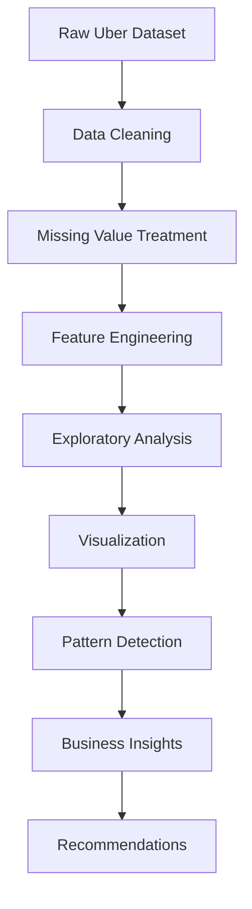

<div align="center">

<style>
@keyframes gradientFlow {
  0% {background-position:0% 50%;}
  50% {background-position:100% 50%;}
  100% {background-position:0% 50%;}
}

@keyframes pulseGlow {
  0% {transform:scale(1); text-shadow:0 0 10px #00BFFF;}
  50% {transform:scale(1.04); text-shadow:0 0 30px #06C167;}
  100% {transform:scale(1); text-shadow:0 0 10px #FF69B4;}
}

@keyframes fadeIn {
  from {opacity:0; transform:translateY(20px);}
  to {opacity:1; transform:translateY(0);}
}

@keyframes rainbow {
  0% {color:#FF0000;}
  20% {color:#FFD700;}
  40% {color:#06C167;}
  60% {color:#00BFFF;}
  80% {color:#FF69B4;}
  100% {color:#8A2BE2;}
}

.glow-title{
background:linear-gradient(-45deg,#00BFFF,#06C167,#FFD700,#FF69B4,#8A2BE2);
background-size:400% 400%;
-webkit-background-clip:text;
-webkit-text-fill-color:transparent;
animation:gradientFlow 8s ease infinite,pulseGlow 3s infinite;
font-size:52px;
font-weight:900;
}

.rainbow{
animation:rainbow 6s linear infinite;
font-weight:bold;
}

.fade{
animation:fadeIn 2s ease;
}

hr{
height:4px;
border:none;
background:linear-gradient(90deg,#FF0000,#FFD700,#06C167,#00BFFF,#8A2BE2,#FF69B4);
background-size:300% 300%;
animation:gradientFlow 5s ease infinite;
border-radius:10px;
}
</style>

<h1 class="glow-title">🚖 UBER DATA ANALYSIS USING PYTHON 🚖</h1>

<h3 class="rainbow">📊 Exploratory Data Analysis • Data Visualization • Business Insights • Pattern Discovery</h3>


</div>

<hr>

# 🚀 Tech Badges

<p align="center">


</p>

<hr>

# 🌟 Project Description

<div align="center">

### 🚖 Turning Raw Uber Trip Data into Actionable Business Intelligence

</div>

This project performs a comprehensive **Exploratory Data Analysis (EDA)** on Uber trip records using Python's powerful data science ecosystem.

Through advanced visualizations and statistical exploration, the analysis uncovers:

✨ Rider demand patterns  
✨ Peak booking hours  
✨ Weekly travel behavior  
✨ High-demand pickup locations  
✨ Seasonal movement trends  
✨ Operational optimization opportunities

The goal is to transform raw transportation data into meaningful insights that can support strategic business decisions.

<hr>

# 🎯 Key Features & Insights

<table>
<tr>
<td width="50%">

### ⏰ Time Intelligence

✅ Peak Hour Analysis

✅ Hourly Demand Trends

✅ Monthly Ride Distribution

✅ Day vs Night Activity

✅ Rush Hour Detection

</td>

<td width="50%">

### 📅 Temporal Analytics

✅ Weekday vs Weekend Comparison

✅ Monthly Usage Patterns

✅ Seasonal Trends

✅ Daily Demand Forecast Indicators

✅ Ride Frequency Analysis

</td>
</tr>

<tr>
<td width="50%">

### 📍 Location Analytics

✅ Most Popular Pickup Points

✅ Demand Hotspots

✅ Geographic Concentration

✅ Pickup Density Exploration

✅ Regional Trend Detection

</td>

<td width="50%">

### 📈 Business Intelligence

✅ Fleet Optimization Insights

✅ Resource Allocation Recommendations

✅ Driver Deployment Strategy

✅ Demand Prediction Indicators

✅ Customer Behavior Understanding

</td>
</tr>
</table>

<hr>

# 🛠️ Tech Stack

<div align="center">

| Technology | Purpose |
|------------|----------|
| 🐍 Python | Core Programming |
| 🐼 Pandas | Data Manipulation |
| 🔢 NumPy | Numerical Computing |
| 📊 Matplotlib | Statistical Visualizations |
| 🎨 Seaborn | Advanced Visual Analytics |
| 🌐 Plotly | Interactive Dashboards |
| 📓 Jupyter Notebook | Development Environment |
| ⚡ Git & GitHub | Version Control |

</div>

<hr>

# 📂 Dataset Information

### 📦 Dataset Contains

```text
Pickup Date
Pickup Time
Pickup Month
Pickup Day
Pickup Hour
Weekday
Uber Base
Latitude
Longitude
Location Information
Trip Records
```

### 📊 Dataset Characteristics

- Large-scale ride records
- Time-series transportation data
- Geospatial pickup information
- Multiple Uber operational bases
- Historical trip activity logs

<hr>

# ⚙️ Installation & Setup

## 1️⃣ Clone Repository

```bash
git clone https://github.com/your-username/Uber-Data-Analysis.git
```

```bash
cd Uber-Data-Analysis
```

---

## 2️⃣ Create Virtual Environment

```bash
python -m venv venv
```

Activate:

### Windows

```bash
venv\Scripts\activate
```

### Linux / Mac

```bash
source venv/bin/activate
```

---

## 3️⃣ Install Dependencies

```bash
pip install pandas numpy matplotlib seaborn plotly jupyter
```

---

## 4️⃣ Launch Notebook

```bash
jupyter notebook
```

<hr>

# 🔄 Project Workflow



<hr>

# 🧹 Data Cleaning Process

### ✔ Missing Value Handling

```python
df.isnull().sum()
df.dropna(inplace=True)
```

### ✔ Duplicate Removal

```python
df.drop_duplicates(inplace=True)
```

### ✔ Datetime Conversion

```python
df['Date/Time'] = pd.to_datetime(df['Date/Time'])
```

### ✔ Data Validation

```python
df.info()
df.describe()
```

<hr>

# ⚡ Feature Engineering

### Extracted Features

```python
df['Hour']
df['Day']
df['Month']
df['Weekday']
df['Weekday_Name']
df['Week_Number']
```

### Example

```python
df['Hour'] = df['Date/Time'].dt.hour
df['Month'] = df['Date/Time'].dt.month
df['Day'] = df['Date/Time'].dt.day
df['Weekday'] = df['Date/Time'].dt.day_name()
```

### Benefits

🎯 Better temporal analysis

🎯 Peak hour identification

🎯 Weekly pattern detection

🎯 Seasonal trend understanding

<hr>

# 🐼 Important Pandas Operations Used

```python
groupby()
pivot_table()
value_counts()
sort_values()
merge()
agg()
apply()
loc[]
iloc[]
query()
```

### Sample Analysis

```python
df.groupby("Hour").size()

df.groupby("Weekday").size()

df.groupby("Month").size()
```

<hr>

# 🎨 Visualization Strategy

### Matplotlib Techniques

```python
plt.style.use("dark_background")
```

```python
plt.figure(figsize=(12,6))
```

### Seaborn Styling

```python
sns.set_style("darkgrid")

sns.set_palette("viridis")
```

### Custom Color Palettes

```python
viridis
plasma
magma
coolwarm
rocket
crest
```

<hr>

# 📊 Key Visualizations

## 🌞 1. Hourly Trip Distribution

```text
📈 Detects busiest booking hours
📈 Peak commuting periods
📈 Driver demand spikes
```

🖼️ Placeholder

```text
[ Hourly Demand Histogram ]
```

---

## 📅 2. Weekday Analysis

```text
Compare ride volume across weekdays
Understand commuter behavior
```

🖼️ Placeholder

```text
[ Weekday Bar Chart ]
```

---

## 📆 3. Monthly Ride Trends

```text
Seasonality analysis
Growth trend exploration
```

🖼️ Placeholder

```text
[ Monthly Trend Line Chart ]
```

---

## 📍 4. Top Pickup Locations

```text
Location popularity ranking
Demand hotspot identification
```

🖼️ Placeholder

```text
[ Location Frequency Chart ]
```

---

## 🚖 5. Uber Base Performance

```text
Operational efficiency comparison
Base demand measurement
```

🖼️ Placeholder

```text
[ Uber Base Count Plot ]
```

---

## 🌍 6. Geospatial Pickup Density

```text
Cluster detection
Urban mobility mapping
```

🖼️ Placeholder

```text
[ Heatmap / Density Plot ]
```

---

## 🔥 7. Correlation Heatmap

```text
Relationship between features
Pattern discovery
```

🖼️ Placeholder

```text
[ Correlation Matrix ]
```

---

## 📊 8. Interactive Plotly Dashboard

```text
Zoomable
Hover Analytics
Interactive Exploration
```

🖼️ Placeholder

```text
[ Interactive Dashboard ]
```

<hr>

# 💡 Major Insights & Business Recommendations

<div align="center">

## 🟢 HIGH IMPACT FINDINGS

</div>

### 🚖 Peak Demand Hours

```diff
+ Highest ride demand typically occurs during commute hours.
+ Additional drivers should be deployed proactively.
```

---

### 📅 Weekday Dominance

```diff
+ Business-day travel often exceeds weekend demand.
+ Optimize fleet allocation around weekdays.
```

---

### 📍 Demand Hotspots

```diff
+ Certain locations consistently generate ride requests.
+ Create hotspot-based driver positioning strategies.
```

---

### 🌙 Night-Time Opportunities

```diff
+ Late-night ride activity reveals untapped opportunities.
+ Improve availability during nightlife hours.
```

---

### 📈 Seasonal Demand Shifts

```diff
+ Monthly fluctuations indicate changing rider behavior.
+ Dynamic resource planning is recommended.
```

<hr>

# 📊 Results & Conclusion

### Key Achievements

✅ Cleaned and transformed raw Uber data

✅ Built advanced visual analytics

✅ Identified temporal ride patterns

✅ Extracted location-based insights

✅ Generated business-focused recommendations

✅ Improved understanding of customer mobility behavior

---

### Final Outcome

The analysis successfully uncovers hidden transportation trends and operational opportunities within Uber trip data. By leveraging Python-based data science tools, the project converts raw trip records into valuable insights that can improve efficiency, driver allocation, customer experience, and strategic decision-making.

<hr>

# 🚀 Future Work

### Upcoming Enhancements

- 🤖 Machine Learning Demand Prediction
- 📈 Forecasting Future Ride Volume
- 🌍 Advanced Geographic Mapping
- 📍 Interactive Location Intelligence Dashboard
- ☁️ Cloud Deployment
- 📊 Real-Time Analytics Pipeline
- 🧠 Customer Segmentation
- 🚖 Driver Performance Analytics

<hr>

# 🤝 Contributing

Contributions are welcome!

### Steps

```bash
Fork Repository
↓
Create Feature Branch
↓
Commit Changes
↓
Push Branch
↓
Open Pull Request
```

### Contribution Areas

✨ Visualization Improvements

✨ Dashboard Development

✨ Machine Learning Models

✨ Documentation Enhancements

✨ Performance Optimization

<hr>

# 📜 License

This project is licensed under the **MIT License**.

```text
Permission is hereby granted, free of charge,
to any person obtaining a copy of this software...
```

<hr>

<div align="center">

# ⭐ LOVE THIS PROJECT? ⭐

### 🌟 Don't Forget To Star The Repository 🌟


<br>

## 🚖 Happy Analyzing • Happy Coding • Happy Learning 🚖

### 💚 Built with Python, Data, and Curiosity 💚


</div>
