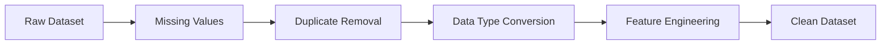
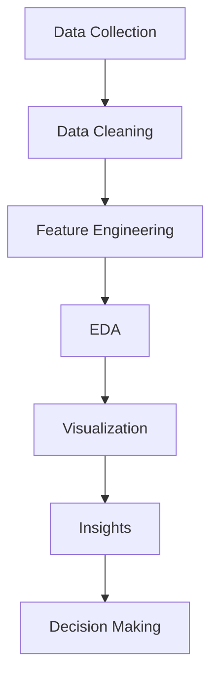

<div align="center">

# 🚖 Uber Data Analysis Dashboard


<br>


</div>

---

<div align="center">


</div>

---

# 🌟 Project Overview

> **Uber Data Analysis** focuses on uncovering valuable insights from ride booking data through advanced data cleaning, transformation, statistical exploration, and visualization techniques.

This project demonstrates the complete **Data Analytics Workflow**:

✨ Data Cleaning  
✨ Data Wrangling  
✨ Exploratory Data Analysis (EDA)  
✨ Statistical Analysis  
✨ Data Visualization  
✨ Business Insights Generation

---

# 🎯 Objectives

<table>
<tr>
<td width="50%">

### 📊 Analyze Ride Patterns
- Peak booking hours
- Demand fluctuations
- Weekly ride trends

</td>

<td width="50%">

### 💰 Revenue Insights
- Fare distribution
- Revenue contribution
- High-performing periods

</td>
</tr>

<tr>
<td>

### 🚕 Customer Behavior
- Frequent pickup locations
- Ride frequency
- Trip duration patterns

</td>

<td>

### 📍 Location Analytics
- Popular destinations
- Traffic hotspots
- Route efficiency

</td>
</tr>
</table>

---

# 🛠️ Technologies Used

<div align="center">

| Tool | Purpose |
|------|----------|
| 🐍 Python | Core Programming |
| 🐼 Pandas | Data Manipulation |
| 🔢 NumPy | Numerical Computing |
| 📈 Matplotlib | Data Visualization |
| 🎨 Seaborn | Statistical Graphics |
| 📓 Jupyter Notebook | Interactive Analysis |

</div>

---

# 📂 Project Structure

```bash
Uber-Data-Analysis/
│
├── data/
│   └── uber.csv
│
├── notebooks/
│   ├── pandas_analysis.ipynb
│   ├── numpy_analysis.ipynb
│   ├── matplotlib_visualizations.ipynb
│   └── seaborn_visualizations.ipynb
│
├── images/
│   ├── heatmap.png
│   ├── histogram.png
│   ├── scatterplot.png
│   └── boxplot.png
│
├── requirements.txt
├── README.md
└── report.pdf
```

---

# 🔍 Data Cleaning Process

<div align="center">



</div>

### Operations Performed

✔ Missing Value Detection

✔ Duplicate Row Removal

✔ Datetime Conversion

✔ Outlier Analysis

✔ Feature Extraction

✔ Column Standardization

---

# 📈 Exploratory Data Analysis

## 📅 Time-Based Analysis

- Hourly Ride Demand
- Daily Ride Trends
- Monthly Booking Distribution
- Weekend vs Weekday Analysis

---

## 🚖 Ride Distribution

```python
sns.histplot(df["Trips"], bins=30, kde=True)
plt.show()
```

### Insights

🔹 Peak rides occur during office hours

🔹 Demand increases on weekends

🔹 Night-time rides show lower frequency

---

## 🌍 Location Analysis

```python
pickup_counts = df['Pickup'].value_counts()

sns.barplot(
    x=pickup_counts.values,
    y=pickup_counts.index
)
```

### Findings

📍 Most active pickup zones

📍 Frequently visited destinations

📍 Traffic congestion indicators

---

# 🎨 Visualization Gallery

## 📊 Heatmap

```python
sns.heatmap(df.corr(), annot=True)
```

---

## 📈 Line Plot

```python
plt.plot(hourly_rides)
```

---

## 📉 Histogram

```python
sns.histplot(df['Fare'])
```

---

## 📦 Box Plot

```python
sns.boxplot(data=df)
```

---

## 🎯 Scatter Plot

```python
sns.scatterplot(
    x='Distance',
    y='Fare',
    data=df
)
```

---

# 🧠 Statistical Insights

<div align="center">

| Metric | Description |
|----------|------------|
| Mean | Average Ride Count |
| Median | Central Ride Trend |
| Mode | Most Frequent Value |
| Variance | Data Spread |
| Standard Deviation | Distribution Consistency |
| Correlation | Feature Relationships |

</div>

---

# 🚀 Key Findings

### 📌 Demand Analysis

- Highest bookings during rush hours
- Strong weekday commuting pattern
- Weekend entertainment peaks

### 📌 Revenue Analysis

- Long-distance rides generate higher revenue
- Premium routes contribute significantly

### 📌 Location Insights

- Central city areas dominate pickups
- Airport routes remain consistently busy

### 📌 Customer Behavior

- Repeat ride patterns observed
- Peak usage linked to work schedules

---

# 📸 Sample Visualizations

<p align="center">


</p>

<p align="center">


</p>

---

# ⚡ Installation

```bash
git clone https://github.com/yourusername/Uber-Data-Analysis.git

cd Uber-Data-Analysis

pip install -r requirements.txt
```

---

# ▶️ Run Project

```bash
jupyter notebook
```

or

```bash
python analysis.py
```

---

# 📦 Required Libraries

```bash
pip install pandas
pip install numpy
pip install matplotlib
pip install seaborn
pip install jupyter
```

---

# 📊 Project Workflow



---

# 🌈 Skills Demonstrated

<div align="center">

🟣 Data Cleaning

🔵 Data Wrangling

🟢 Statistical Analysis

🟡 Feature Engineering

🟠 Data Visualization

🔴 Exploratory Data Analysis

⚫ Business Intelligence

</div>

---

# 👨‍💻 Author

<div align="center">

## Geershati Saxena


### ⭐ If you found this project useful, consider giving it a Star!

</div>

---

<div align="center">


</div>
